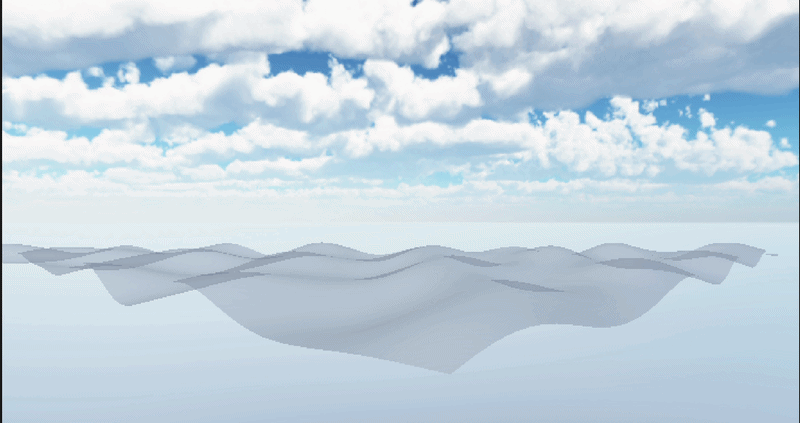
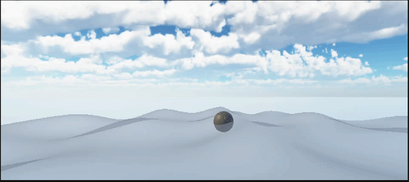
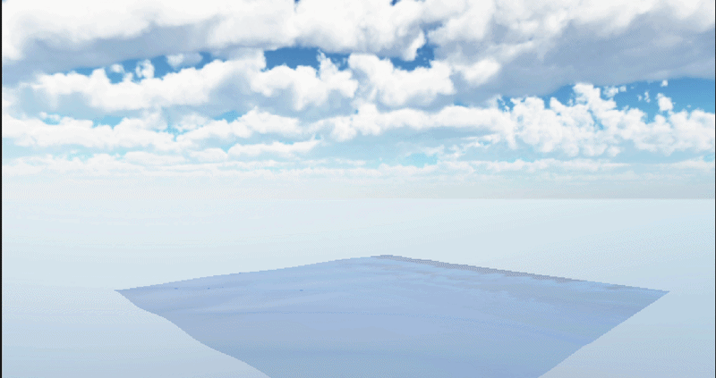
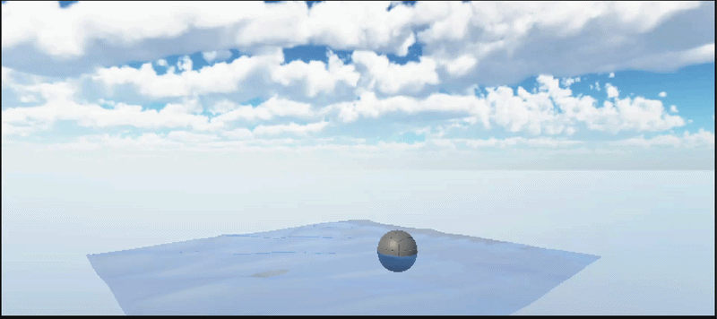

# DH2323-Project-Repo - Water Simulation in Unity
This is my project repo for the course DH2323 Computer Graphics and Interaction VT26

## Overview
This project explores real-time water simulation in Unity by comparing:
- Gerstner wave-based water simulation
- A simplified Navier–Stokes (shallow water) approach

## Project Goal
The goal of this project is to explore water simulation, which is considered one of the most challenging problems in computer graphics, especially in games and films. There are two main approaches to simulating water: wave-based models and physics-based models. To better understand the differences between these two approaches, this project aims to compare their performance and visual realism in a real-time Unity environment.

## Features
- Gerstner wave implementation
- Physics-based shallow water simulation (simplified Navier–Stokes)
- FPS performance comparison

## Technologies
- Unity (version 6.4)
- C#

## Results
| Scenario | Gerstner FPS | NS-based FPS |
|---|---|---|
| Water waves only | ~315 | ~736 |
| Floating object | ~293 | ~702 |

The results show that the NS-based model achieves higher frame rates due to its simpler per-frame computation, while Gerstner waves produce smoother and more structured large-scale wave patterns. However, the NS model provides better floating object interaction through height field coupling.
See the full report for more details.

## Screenshots
### Gerstner Waves

### Gerstner Waves with Object

### NS-based model

### NS-based model with Object

## How to run 
1. Clone repository
2. Open in Unity
3. Load main scene
4. Press Play
